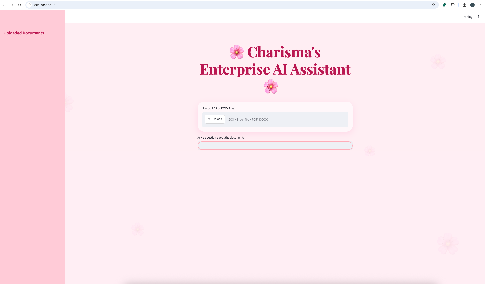
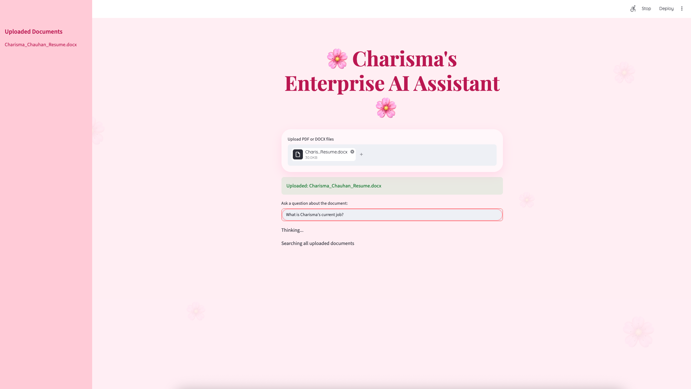
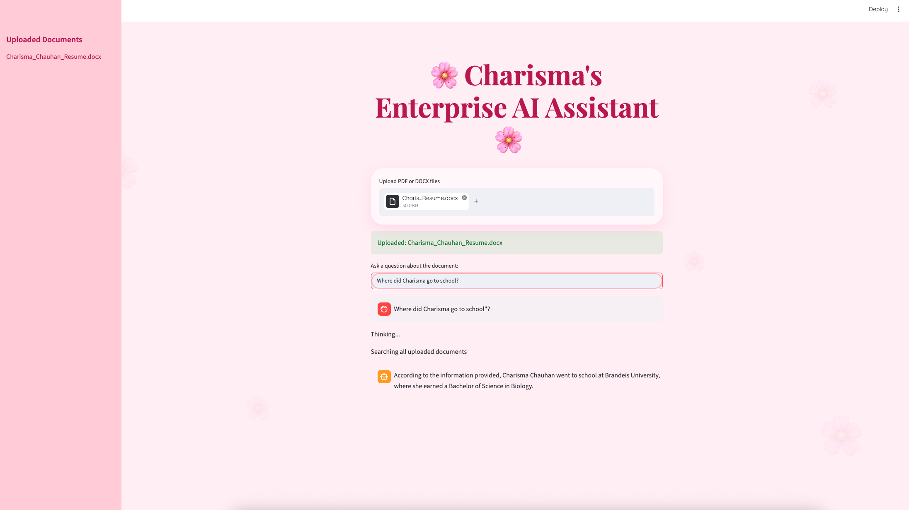

# 🌸 Enterprise AI Assistant

A local Retrieval-Augmented Generation (RAG) application that enables question answering across multiple PDF and DOCX documents using semantic search, vector embeddings, and Llama 3.
## Application Preview

### Home Screen



### Document Upload



### Question Answering


---

## Features

* Multi-document question answering
* PDF and DOCX support
* SentenceTransformer embeddings
* ChromaDB persistent vector database
* Semantic search using embeddings
* Source attribution
* Conversational memory
* Streamlit web interface
* Local Llama 3 interface with Ollama

---

## Tech Stack

* Python
* Streamlit
* Ollama
* Llama 3
* ChromaDB
* Sentence Transformers
* LangChain
* PyPDF
* docx2txt

---

## Architecture

1. Upload PDF or DOCX documents.
2. Documents are chunked into smaller sections.
3. Sentence Transformers generate embeddings.
4. Embeddings are stored in ChromaDB.
5. User questions are embedded and matched against relevant chunks.
6. Retrieved context is sent to Llama 3 via Ollama.
7. Answers are returned through the Streamlit interface.

---

## Running Locally

```bash
pip install -r requirements.txt

ollama run llama3

streamlit run app.py
```

---

## Example Questions

* What certifications does this person have?
* How many jobs have been applied to?
* Which companies are currently interviewing?
* Summarize the uploaded documents.

---

Built with ❤️ using Python and local LLMs.
